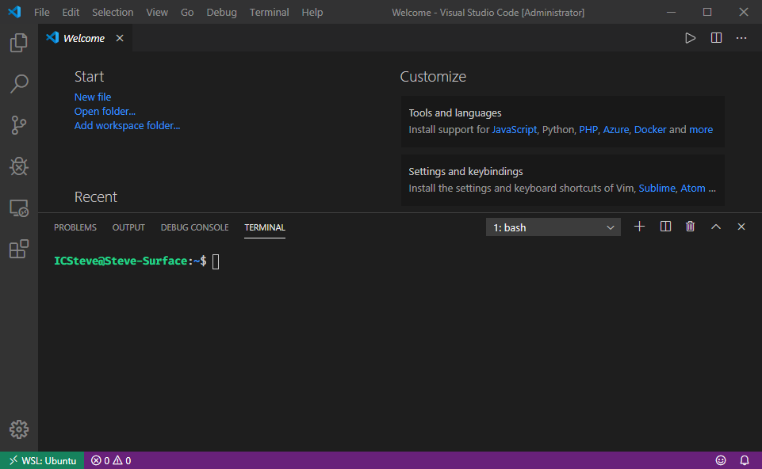

# 我的文档工作流 （工具篇）

## 效果预期与知识储备

我在本文中分享我的文档工作流方法，那么你可以轻松用markdown 来表达自己，高效地管理下面一些工作中常用到的文档类型。

- 产品手册
- 演示文档
- 邮件模板
- 代码管理
- 知识积累

### 知识储备

此内容适合所有人，无论是基础篇还是高级篇都不需要花费很大的时间精力去掌握，内容很直接，没有太难的学习曲线。

- 基础篇
  - Markdown
  - Unix Environment
- 高级篇
  - Javascript
  - HTML/CSS

## 个人内容组织原则

- 所有内容必须能用最简单的文本编辑器打开
- 标记方法必须要尽量使用
- 定期做Review 和Update，知识之间要连接
- 避免知识内容收集的重复
- 给内容分等级，优先级的等级，专业程度的等级，兴趣的等级等等

即使我养成了上述习惯，我还是会定期去过一遍list，看最近是不是有哪几项没有做。

## 工具安装

### WSL: Ubuntu

在Windows 环境中，推荐安装WSL。近几个月的更新，Windows 的Power Terminal，Visual Studio Code 已经可以很好地和WSL 互动了，开发的体验已经比之前好很多倍了。



### Markdown Editor

近几年流行起来的Visual Studio Code 很好8用，安装也非常简单，[https://code.visualstudio.com/](https://code.visualstudio.com/) 从官网下载安装文件。

我之前购买过收费的markdown 工具，以前markdown 并没有像标配一样被很多工具支持，但我一看见它就被它的简洁吸引了，然后我逐渐去看更多和标记语言有关的内容和积累自己的库，比如js markdown-it，php parsedown，python Python-Markdown 当然还有很多啦。

Markdown 语法参考

[https://www.markdownguide.org/basic-syntax/](https://www.markdownguide.org/basic-syntax/)

### Docsify

文档的框架分为两个派，一派是写完文档需要做一次“生成”的动作，另一派是直接动态解析源文件，没有一个中间生成的过程。

我偏向于直接解析Markdown 源文件的一派，Docsify 就是属于这一派。

https://docsify.js.org/

几乎无需安装，一个index.html 就可以完成工作，sWeb 已经将这个实例放到了template 内，包括所有的js 和css。

- [快速开始](https://docsify.js.org/#/quickstart)
- [如何设置sidebar](https://docsify.js.org/#/more-pages?id=sidebar)
- [如何设置navbar](https://docsify.js.org/#/configuration?id=loadnavbar)

下面是 http://icsteve.com 使用的index.html，外加了几个有用的插件。

- toc
- external-script
- search
- docsify-pagination
- docsify-tabs
- docsify-example-panels
- emoji
- pdfobject
- docsify-pdf-embed
- ocsify-plugin-flexible-alerts
- docsify-footer-enh
- zoom-image

```html
<!DOCTYPE html>
<html>
<head>
  <!--
  No
  <base target="_blank">
  -->
  <meta http-equiv="X-UA-Compatible" content="IE=edge,chrome=1">
  <meta name="viewport" content="width=device-width,initial-scale=1">
  <meta charset="UTF-8">
  <link rel="stylesheet" href="icsteve.css">
  <link rel="stylesheet" href="http://icsteve.com/vendor/docsify/4.8.3/plugins/toc.css">
  <link rel="shortcut icon" href="favicon.ico" type="image/x-icon">
  <style>
    :root {
      --docsifytabs-border-color: #ededed;
      --docsifytabs-tab-highlight-color: purple;
    }
    h1 .anchor span {
      color: #f05e2f ;
    }
    .emoji {
      height: 0.91rem ;
      padding-bottom:3px;
    }
  </style>
</head>
<body onload="WaveDrom.ProcessAll()">
  <div id="app">Please wait...</div>
  <script>
    window.$docsify = {
        basePath:".",
        search: 'auto',
        subMaxLevel:5,
        loadSidebar: true,
        loadNavbar: true,
        tabs: {
          persist    : true,      // default
          sync       : true,      // default
          theme      : 'classic', // default
          tabComments: true,      // default
          tabHeadings: true       // default
        },
        alias: {
          '/.*/_sidebar.md': '/sidebar.md'
          ,'/.*/_navbar.md': '/navbar.md'
          ,'/_navbar.md': '/navbar.md'
          ,'/_sidebar.md': '/sidebar.md'
        }
        ,footer: {
        copy: '<span>IC Steve &copy; 2019</span>',
        auth: ' 转载引用请注明出处',
        pre: '<br/>',
        style: 'text-align: right;'
      }
    }
    if (typeof navigator.serviceWorker !== 'undefined') {
      navigator.serviceWorker.register('sw.js')
    }
  </script>
  <!-- libraries -->
  <script src="http://icsteve.com/vendor/docsify/4.8.3/docsify.min.js"></script>
  <script src="http://icsteve.com/vendor/docsify/4.8.3/plugins/external-script.min.js"></script>
  <script src="http://icsteve.com/vendor/docsify/4.8.3/plugins/search.min.js"></script>
  <script src="http://icsteve.com/vendor/docsify/4.8.3/plugins/docsify-pagination.min.js"></script>
  <script src="http://icsteve.com/vendor/docsify/4.8.3/plugins/docsify-tabs.js"></script>
  <script src="http://icsteve.com/vendor/docsify/4.8.3/plugins/docsify-example-panels.js"></script>
  <script src="http://icsteve.com/vendor/docsify/4.8.3/plugins/emoji.min.js"></script>
  <script src="http://icsteve.com/vendor/docsify/4.8.3/plugins/pdfobject.min.js"></script> 
  <script src="http://icsteve.com/vendor/docsify/4.8.3/plugins/docsify-pdf-embed.js"></script>
  <script src="http://icsteve.com/vendor/docsify/4.8.3/plugins/docsify-plugin-flexible-alerts.min.js"></script>
  <script src="http://icsteve.com/vendor/docsify/4.8.3/plugins/docsify-footer-enh.min.js"></script>
  <script src="http://icsteve.com/vendor/docsify/4.8.3/plugins/zoom-image.min.js"></script>
  <!--
  <script src="./vendor/docsify/4.8.3/plugins/toc.js"></script>
  -->
</body>
</html>
```

更多开箱即用的实例请关注[ICSteve 知识星球](https://wx.zsxq.com/dweb2/index/group/88518421841542) （收费）。

### Marp

Marp 的官网：https://marpit.marp.app/

安装Marp 的Cli 工具。

```sh
npm install --save-dev @marp-team/marp-cli -g
marp -v
```

> @marp-team/marp-cli v0.16.2 (w/ @marp-team/marp-core v0.15.2)

Marpit 可以做为库使用，内部使用了markdown-it 解释markdown 文件的结构。

Marp 可以使用theme，我制作了一个theme 以及background，很容易制作一个模板。我制作了我司的PPT 模板的Marp theme，markdown 直接生成PPT 是HTML 格式，方便更新的发布，不像固定的文件需要不断的发送PPT 文件，HTML 在浏览器里浏览，也很容易保存成PDF，Marp 本身也可以存为PDF 格式。


更多开箱即用的实例请关注[ICSteve 知识星球](https://wx.zsxq.com/dweb2/index/group/88518421841542) （收费）。

### Mjml

https://mjml.io/

由于Outlook 显示HTML 的方式就像IE 一样特殊，要很多特殊的处理方式。MJML 使用自己的标记语言来统一各个平台下的显示问题，一套语法适合桌面端客户端（Outlook 等）以及移动端各种邮件app。

对于这个工具我并没有完全部署到我自己的环境中，只是参考它转换出来的HTML，并参考这些HTML 搭建自己的HTML 邮件模板。

更多开箱即用的实例请关注[ICSteve 知识星球](https://wx.zsxq.com/dweb2/index/group/88518421841542) （收费）。

### Asciinema

这个工具可以帮助你录制Terminal 的一个工具，效果可以参考

[https://asciinema.org/](https://asciinema.org/)

我并没有安装，使用的是 Running from source

```sh
git clone https://github.com/asciinema/asciinema.git
cd asciinema
python3 -m asciinema --version
```

录制完成后，可以通过[asciinema-player](https://github.com/asciinema/asciinema-player) 来对录制的内容进行播放，可以轻松插入到docsify 文档中。

更多开箱即用的实例请关注[ICSteve 知识星球](https://wx.zsxq.com/dweb2/index/group/88518421841542) （收费）。

### Webserver

很多内容是已经往web 方向发展了，所以我们需要假设一个本地的服务器以测试和运行很多功能，当然nodejs 本身有server 模块，为了简单和扩展，我也安装了XAMPP，而且平时也会用到nodejs 的server 以及sWeb。

https://www.apachefriends.org/index.html

## 工具篇总结

互联网还在初期发展阶段的时候，掌握word 和excel 是很多工作，学习的一大技能，可以让你所做的事情事半功倍，现在掌握一些Web 技能，Python 技能，Tcl 技能或者其他脚本程序，这种过程非常类似那时候的office 技能，这些基本技能也正在被逐渐加入到课堂。

当然我们不能只停留在使用的阶段，工具越来越开放，我们使用工具的方式正在变化。

更多开箱即用的实例请关注[ICSteve 知识星球](https://wx.zsxq.com/dweb2/index/group/88518421841542) （收费）。

