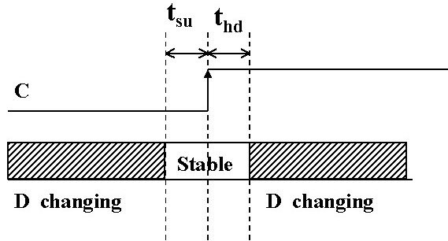
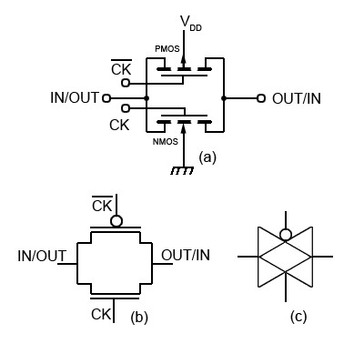
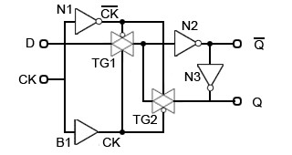
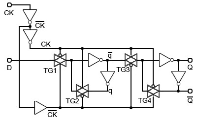

# Why setup and hold time

对于setup和hold的定义大家都知道，也相信大家都理解它，应用起来很顺手，看看以下几个问题，如果你不知道可以看看本文。

- FF为什么有setup 和hold time 的要求？
- 理想情况下hold time 按定义是基本满足的，那么violation 产生的本质是什么？
- 某些library，setup time 是负值，怎么做到的？

## Setup & Hold

我们先来回忆一下setup 和hold 的定义。

Setup time is defined as the minimum amount of time before the clock’s active edge that the data must be stable for it to be latched correctly. Any violation may cause incorrect data to be captured, which is known as setup violation.

建立时间就是时序器件有效沿到来之前数据必须稳定的最少时间，建立时间违规会造成数据捕获出错。

Hold time is defined as the minimum amount of time after the clock’s active edge during which data must be stable. Violation in this case may cause incorrect data to be latched, which is known as a hold violation.

保持时间是时序器件有效沿之后数据必须保持稳定的最少时间，保持时间违规会造成数据在器件内保存出错。

Note that setup and hold time is measured with respect to the active clock edge only.

setup和hold都是相对有效时钟沿来说的。

## CMOS FF的构成

### 传输门 Transmission Gates

传输门的功能很简单，当CK 为低电压（Logic 0）时，NMOS的substrate即衬底供电为低电势，NMOS 管处于关闭状态，PMOS 的substrate 即衬底供电为高电势，PMOS管也处于关闭状态。

当CK为高电压（Logic 1）时，相反NMOS，PMOS 的substrate 分别处于高电势和低电势，MOS 管的source 源和drain 漏电压会充放电到相同电位，即整个传输门处于导通状态。

### 触发器 Latch

由传输门和基本门电路组成的触发器，这是是最基本的结构，实际中为了达到某些效果，比如高速、面积最优、特殊的setup，hold时间等，电路会有所不同。

电路中的门充放电是需要时间的，比如反相器的cell delay 是0.2ns，传输门的delay 可能是0.2ns等等。

#### CK=1

当CK为高电平时，TG1 打开，TG2 关闭，D 端数据通过TG1，到达TG2 的输入端，而TG2处于关闭状态，Q 端数据直接来自于TG1 的输出，即D=Q，数据传输需要经过TG1，N2 和N3。

#### CK=0

当CK为低电平时，TG1 关闭，TG2 打开，D 端杯TG1 block，无法通过TG1，而TG1 输出端的数据通过TG2 被传输到Q 端，数据被保持住上一个状态的值。

由此可看出，这是一个我们通常说的latch，由电平触发。

### 触发器 Flip-Flop

由两个上述的latch构成一个沿触发的触发器。

TG1和TG2构成了master FF，TG3 和TG4 构成了slave FF。

当CK为0即低电平时，master FF 处于透明状态，D 数据通过master FF，而此时slave FF 处于阻断状态，维持Q 端数据不变，master FF 锁定D 的过程中，D 必须保持不变，这样master FF 所存的数据才是可靠的，可知的，那么这段电平由低变高之前，D 通过master FF 的时间就是setup time 吗？非也，setup time 是TG1 和TG2 的skew。所以本质上setup 是clock 到达与否的描述，所以本质上是一段clock skew（假设clock 是ideal 的，没有transition）。这才有了setup 可以是负值的可能。

当CK 为1即高电平时，master FF 被block，slave FF 处于透明状态，D已经被master FF 阻隔了，Q 端如果需要获得Master FF 锁存的数据，必须经过一定的时间，即数据通过slave FF 的时间，这段时间过后，Q端的数据将稳定不变了。那么hold 本质上是一段clock latency（假设clock 是ideal 的，没有transition）。

当然setup 和hold 都要考虑MOS 管的充放电时间，transition 的影响。

## 回答文首问题

我们回到最初提到的两个问题。信号稳定当然要经过传输门和线，门延时和线延时都是客观存在的，但在一个cell里面，我们暂且认为这是个定值，知道它存在就好。

hold violation 产生的本质是什么？

我们看上面的图，只要CK 到TG3 做得足够短，其实hold time 可以控制得很短，当然做不到0。从这个角度来说，launch 出来的数据，经过launch FF，经过一段线延时，很容易满足capture 的hold time 要求，design 中那么多hold violation 哪里来的？

timing path 中的hold violation 与这个内部结构没有太大关系，都是由于skew 产生的，launch clock latency 短于capture clock latency。

第二个问题，setup 为什么可以是负值，前面讲了setup 本质上是一段skew，skew 当然可以做到可正可负。只要到达TG2 的clock latency 长于到达TG1 的clock latency，那么setup 就是一个负值。
