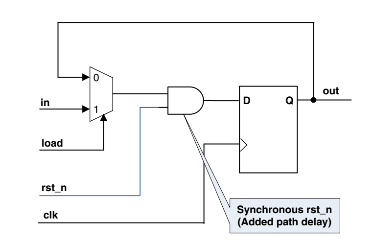

# CDC and RDC

CDC: Clock Domain Crossing

Q1: Why CDC should be pay attention to?

Data transfers between 2 clock domain will produce metastable state.
Cause CMOS Damage

2 or more Flip-Flop Synchronizer.

Q1.1: Why 2 or more

If data changes too fast

MTBF, it is related to 2 frequency.

同步电路结构，每种的应用场景

如何做约束，同步器的级数

RTL Power 分析
Power Domain 的确定
Low Power Cell 的特性
功耗如何优化

dynamic power:

mvdd, use power gate to shut down some domains.
dvfs, lower the voltage for some function.
clock gating, reduce the toggle rate

## RDC

Reset tree is similar to Clock tree.

The primary purpose of a reset is to force the SoC into a known state for stable
operations. This would avoid the SoC to power on to a random state and get hanged.

In a design, we could have hundreds of clocks, but usually we have several reset.

- hardward reset
- software reset
- other types

Reset strategy

- use synchronous or asynchronous resets

One problem with synchronous resets is that the synthesis tool cannot easily
distinguish the reset signal from any other data signal. The synthesis tool could
alternatively have produced the circuit. which will cause the reset fail.

- will every flipflop receive a reset

Domain crossing:
