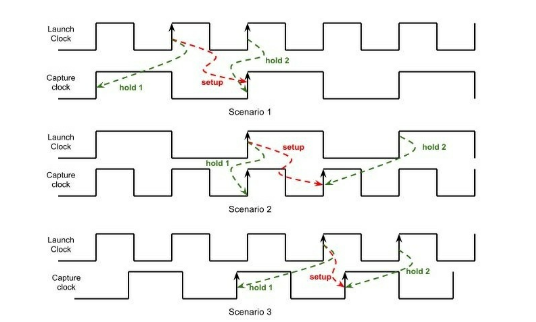
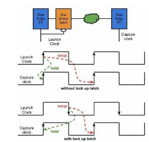
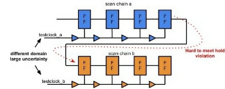
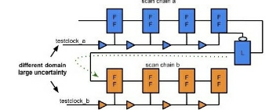

# Timing

## Basic

- STA
  - 结果悲观，很多PATH 不一定需要约束，实际中没有用到
  - 无法验证异步时序
  - 需要定义Constraint
- Logic DRC
  - max transition
  - max capacitance
  - max fanout
- glitch
- Setup
- Hold
- arrival time
- required time
- slack
- data path
- timing constraints exceptions
  - false path
  - mcp
  - min/max delay
- clock latency
- uncertainty
  - synthesis (margin for physical design and signoff)
  - place (skew + jitter + signoff uncertainty + ocv)
  - cts (jitter + ocv + signoffuncertainty)
  - route ()
- clock gating
  - MUX
  - latch + AND
- OCV
  - POCV
  - AOCV

- Macro Placement
  - fly line
  - port Communication
  - leave the area for std
  - space between macros
  - macro alignment
  - finfet requirement
  - orientation
  - blockage
  - cross placement
- Fix Crosstalk
  - aggressor and victim spacing (NDR double spacing)
  - shielding
  - power
  - big driver
  - layer jumping
  - double width (victime width)
  - guard ring
  - cell up sizing
  - NDR is for EM and Crosstalk

- ICG 问题
  - 简易结构
  - Latch 结构
    - 解决glitch
    - power 少相比较用下降沿FF
    - full cycle， 下降沿只有沿采样

## Register Setup / Hold

## Latch recovery and removal

## Useful Skew

## STA Methodology

## Questions

同一个path 同时发生setup 和hold violation

- same PVT
  - 相同SP 和 EP，不同的组合逻辑路径
  - 不同的derating 导致

- different PVT
  - 不同的PVT 下，input transition 和 output capacity 差异
  - 不同的derating 导致

- Transition Violation
  - timing out of table (LUT cell delay is based on input transition and output load)
  - SI
  - Dynamic Power
  - fixing
    - big driver
    - reduce route length
    - no high fanout

set_annotated_delay
set_annotated_check

Reduce Dynamic Power
P=1/2 V^2 C R(toggle rate)

- Input Voltage
- Output Capacitance

Hybrid Timing Analysis

Use Dynamic Timing Analysis to guide the STA

Hardware-Software Co-synthesis Fast timing check

Spyglass inputs and output

It is a kind of static check.

My understanding of static check and dynamic check.

## What is STA (Static Timing Analysis)

Static Timing Analysis is a technique of analysing timing paths in a digital logic by adding up delays along a timing path (both gate and interconnect) and comparing it with constraints (clock period) to check whether the path meets the constraint.

In contrast to the dynamic spice simulation of whole design, static timing analysis performs a worst case analysis using very simple models of device and wire delays.

A lookup table model or a simple constant current or voltage source based model of device is used. Elmore delay or equivalent model is used to quickly figure out wire delays.  Static Timing Analysis is popular because it is simple to use and only needs commonly available inputs like technology library, netlist,  constraints, and parasitics(R and C).

Static Timing Analysis is comprehensive and provides a very high level of timing coverage. It also honours timing exception to exclude the paths that are either not true path are not exercised in an actual design. A good static timing tool correlates well with actual silicon.

## What are all the items that are checked by static

Static Timing Analysis is used to check mainly the setup and hold time checks. But it also checks for the assumptions made during timing analysis to be holding true. Mainly it checks for cells to be within the library characterization range for input slope, output load capacitance. It also checks for integrity of clock signal and clock waveform to guarantee the assumptions made regarding the clock waveforms. A partial list of things it checks is here :  Setup Timing Hold timing  Removal and Recovery Timing on resets Clock gating checks Min max transition times Min/max fanout Max capacitance Max/min timing between two points on a segment of timing path. Latch Time Borrowing Clock pulse width requirements

## Describe a timing path

For standard cell based designs, following figure illustrates basic timing path. Timing path typically starts at one of the sequential (storage element) which could be either a flip-flop or a latch. The timing path starts at the clock pin of the flip-flop/latch. Active clock edge on this element triggers the data at the output of such element to change. This is the first stage delay which is also called clock -> data out(Q) delay. Then data goes through stages of combinational delay and interconnect wires. Each of such stage has its own timing delay that accumulates along the path. Eventually the data arrives at the sampling storage element, which is again a flip-flop or a latch. That’s where data has to meet setup and hold checks against the clock of the receiving flip-flop/latch. Also notice for the timing paths in the same clock domain, generating flip-flop clock and sampling flip-flop clocks are derived from a single source, which is called the point of divergence. In reality, actual start point for a synchronous clock based circuits is the first instance where clocks branch off to generating path and sampling path as shown here in the picture, which is also called point of divergence. To simplify analysis we agree that clock will arrive at very much a fixed time at the clock pin of all sequentials in the design.  This simplified the analysis of the timing path. from one sequential to another sequential.

## What are different types of timing paths

## What are setup and hold checks for clock gating and why are they needed

The purpose of clock gating is to block the clock pulses and prevent clock toggling. An enable signal either masks or unmasks the clock pulses with the help of an AND gate. As it is clock signal which is in consideration here, care has to be taken such that we do not change the shape of the clock pulse that we are passing through and we don’t introduce any glitches in the clock pulse that we are passing through.

As you can see in the figure the enable signal has to setup in advance of the rising edge of the clock in such a way that it doesn’t chop the rising edge of the clock. This is called the clock gating setup or clock gating default max check.  Similarly the tuning off or going away edge of the enable(EN) signal has to happen well past the turning off or going away edge of the clock, again to make sure it doesn’t get chopped off. This is called the clock gating hold or clock gating default min check.

## One chip which came back after being manufactured fails setup test and another one fails a hold test. Which one may still be used how and why

## What is Max Timing Equation

## What is reset recovery time
For a flip flop with asynchronous reset pin, only the asserting edge(active edge) of reset is asynchronous. Which means if reset pin is active low(reset bar), only reset signal going down(falling) can happen asynchronously without the knowledge of the clock. But once the reset has gone active, it has to de-assert at some point in time and has to get the flip flop out of the reset state. This reset de-assertion can not happen independently of the clocks. The way such flip flops are designed, the reset de assertion has to happen certain time before the active edge of the clock for the flip flop. This is very similar to setup check for data, and this requirement of reset de-assertion before the active edge of the clock is called the recovery time.

## What is rest removal time
Removal time is the counterpart of recovery time. It is exactly hold time equivalent of recovery time. Just like in recovery time, reset deassertion has to happen certain time before the active edge of the clock, removal time requirement is where the reset deassertion has to hold past the active edge of the clock. Reset deassertion can not happen right around the clock edge, it has to happen certain time after the active edge of the clock.

## mutiple cycle setup/hold check
What type of setup and hold checks will be performed when launch and capture clock are not of the same frequency  ?  Answer S22):  Let’s consider three case scenarios here.  Scenario 1) Launch clock is a multiple of capture clock and is twice as fast as capture clock.

We will assume rising edge launch and capture flops here. Lets look at scenario 1), here the launch clock is faster than the capture clock. As stated earlier, tool will pick the shortest distance between two active edges in launch and capture clock for the setup timing check. The clock edges and actual setup check is shown with dotted red line. Setup check is relatively straightforward. Once having found setup check, it will look at the two typical possibilities for finding hold check. Two hold check possibilities are shown with green dotted line. First one is from the launch of the setup check to the one clock cycle earlier than the setup capture edge of the capture clock. This is hold check number 1. Second possibility is the check from active edge of the launch clock which is one cycle later than the setup check launch edge to the setup capture edge of the capture clock again

shown in green dotted line as hold check number 2. As you can see in the figure hold check 2 is more stringent, hence tool will pick scenario 2 for hold check.  In scenario 2) where launch clock is slower than the capture clock. Analysis is similar to earlier scenario and we can see that hold check 1 is more stringent, hence tool picks hold check 1.  In scenario 3) hold 2 seems to be more stringent and will be picked as the hold check.  Unless specific overrides or exceptions to instructions are given to timing tool, it doesn’t care about the nature and frequency of the launch and capture clocks, it will stick to the worst-case behavior to perform the timing checks.  Many times, the tool might perform wrong checks, as it might violation design intent while performing the worst case check. We will look at such case in subsequent questions.

## How does lockup latch help with avoiding hold violations

If you understand hold time check very well, or if you have been analyzing the waveforms for hold time check, you will realize that hold time issues start happening as soon as launch and capture clock edge align with each other or are very close to each other.  We know that more spread apart launch and capture edge are in such a way that launch edge is later than the capture edge, less of a hold time concern there is.  We know that when launch and capture clock are from the same source and have same waveform, the greatest distance between an edge in launch clock and an edge in capture clock can not be greater than clock phase. Because if try to do that you will approach one of the edge closer on the other side.  If the falling edge of clock is the launch edge and rising edge of clock is capture edge, we know that launch and capture edge would be a phase apart and as long as launch edge happens after capture edge, we would have a phase worth of margin for hold check. This is true for the case where falling clock edge is capture edge and rising edge is launch edge. The key is that they are a clock phase apart and launch happens later than capture.

This is what exactly a lock up latch achieves. It changes the launch edge from rising to falling edge and capture edge remains rising. So we get launch and capture edges to be farthest apart(clock phase) giving us best possible hold time protection. Also launch happens later than capture, which is what we want. Lets take a look at the figure below to better understand this.

Here we are assuming launch and capture flops to be rising edge triggered. As shown in figure before lock up latch, it’s a simple setup and hold check. The issue is this type of hold check ( also called race as launch and capture edges are the same, it is like a data race), it could be very difficult and expensive to fix this type of hold violations, if launch and captured clock common points are far apart, there could be quite a large clock uncertainty. This is very typical for scan or test clocks

where last flop in one scan chain is in a specific clock domain and first cell of next scan chain is in a different clock domain. There could be large hold violations for such paths.  Low phase latch, launches data at the falling edge of the clock and remains transparent during low phase. Essentially by introducing the lockup latch, we moved launch edge from rising to falling, and now our launch and capture edges are a clock phase apart, we have a clock phase worth of margin(slack) to meet the hold time requirement.

As shown in figure there can be a large uncertainty between testclock_a and testclock_b. If you recall from the hold margin equation, larger the clock uncertainty larger the negative slack that will have to be fixed.  In such situations the lockup latch is introduced between the two chains to address the hold violation.

One has to realize that lockup latch doesn’t come completely free. Because it changes the launch edge from rising to falling, we are modifying our setup or max timing path from the original launch flop to capture flop from a full clock cycle to half clock cycle(clock phase). Normally you would think of adding lockup latch only if you had hold issues to begin with which means, there was not a setup problem to begin with. Because if you had hold problems that means there wasn’t much path delay from the launch flop to capture flop.

what is Statistical STA

