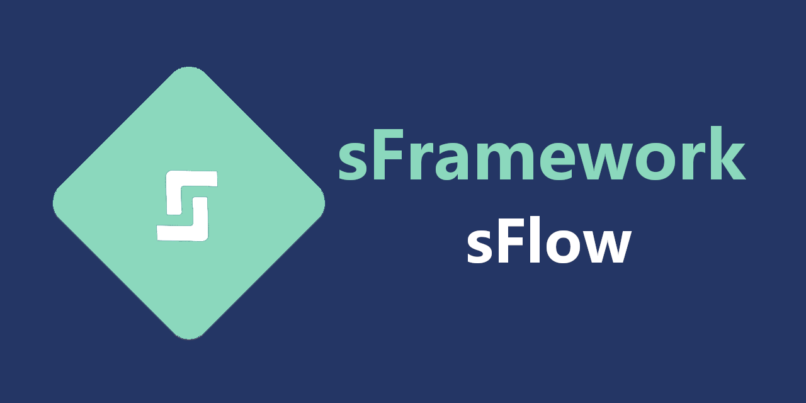
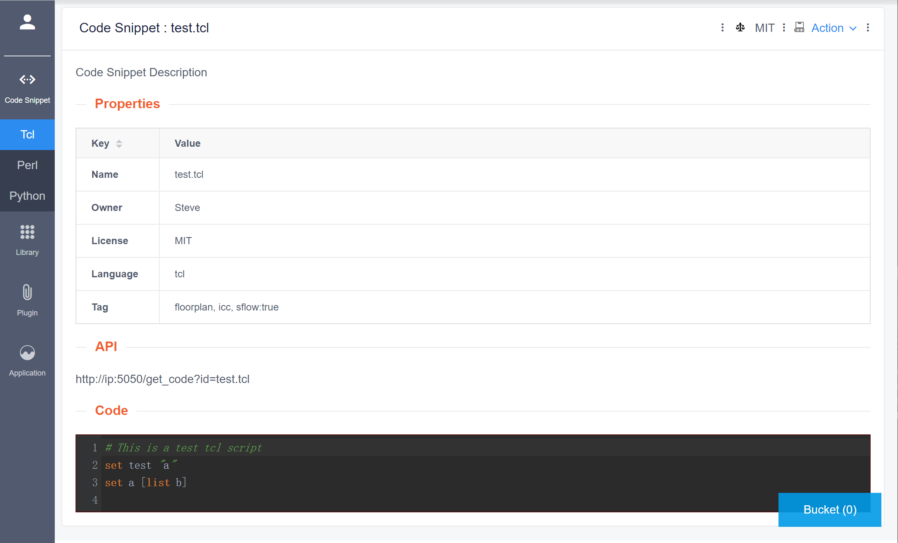

# 工程师自己的脚本管理工具 - sFlow (WUI)

Script 多起来没有一个好的工具管理，常常是项目结束以后，很多经验留在脚本里需要花大量的时间去提取这些经验。

我苦苦寻觅一款工具，想要高效的管理我的Synthesis 脚本，Place and Route 脚本，还有平时的一些shell，tcl，perl，python，php，很少的c/c++，javascript等等。

既然找不到合适的，身为一个CAD 攻城狮，那就自己造一个吧。

而且这个WUI 是Web UI 的意思，是Web 的界面，而服务器的CLI更是流程管理的利器。

## Features

- 代码自动入库
- 可管理脚本片段，库，插件和应用
- 脚本嵌套构建，逻辑简洁
- 离线版仅支持单人模式，高级版和在线版支持用户注册
- 功能插件化，方便扩展
- 高级版和在线版支持“云”应用，支持任意碎片化上云
- 更多功能敬请期待

## 开放时间

- 加入ICSteve 知识星球可获得sFramework/sWeb 代码，开箱即用
- 加入ICSteve 知识星球可第一时间获得离线版sFramework/sFlow（WUI）更新，首版发布大约在二月中旬
- 加入ICSteve 知识星球可获得sWeb 与sFlow 的开发教程，收录于“IC CAD 养成记 vs 职业篇” 连载系列

