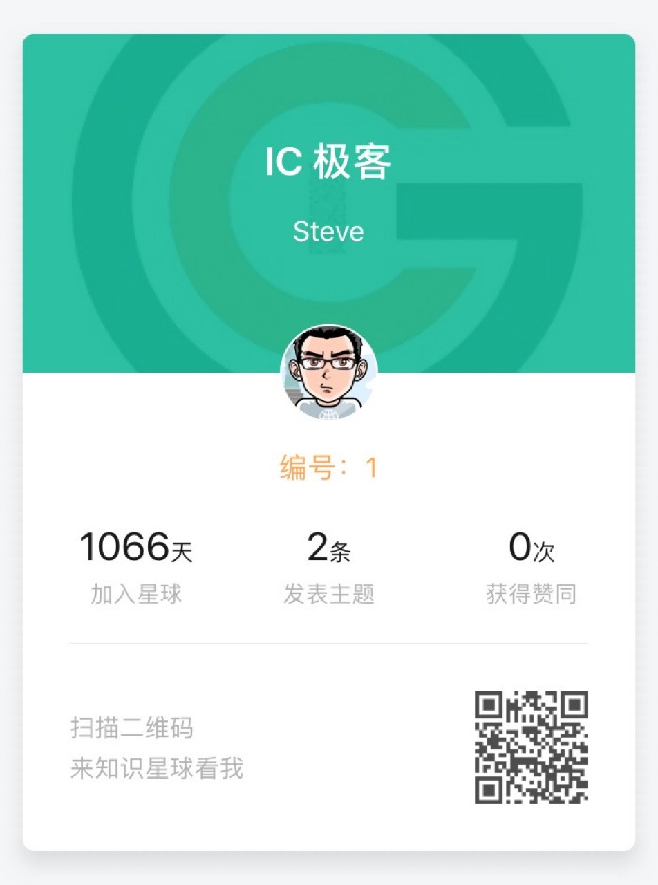
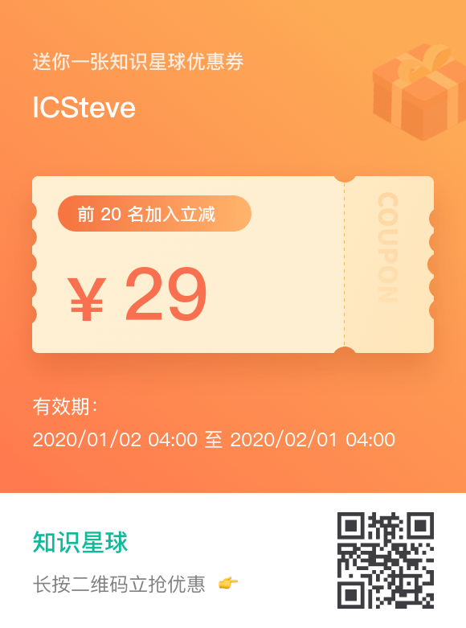

# 知识星球权益 27

我在知识星球还叫小密圈的时候就加入了，我的历史是1066天。

从那时开始就建立的群一直没有发文章，2020 的一个小目标就是做一些纯粹的东西，做一些商业化的探索是可以的，但是纯商业化意味着放弃很多东西，也带来一些风险，貌似我的内心很多时候不能接受这样的风险（年轻真好）。

最近关于工作期间维护的开源项目被公司“绑架”的例子和提问由于某个特殊的事件被广泛讨论，所以我更倾向于做一些概念和与公司内容不冲突的东西。

知识星球的收费为128=27，由此我总结了7条权益，有些是我单向提供的，有些是需要双向合作的。

- 1. 整年提供至少50 篇的文章更新，内容围绕IC 设计，主要在CAD 和物理实现
  - 首发于知识星球，比其他平台早一周
- 2. 每篇文章提供实操练习，比例不低于50%，就是至少25篇
- 3. 2020 计划写两本个关于Tcl 和CAD Framework 的书，内容互相交叉，侧重不同
  - 每位用户可免费获得一本
- 4. 开设一门在线CAD 课程连载，文字部分可以保证会在星球同步发布，会与书本的内容有重合
- 5. 我每月做一次用户在线交流，文字语音皆可：形式可以是微信群，星球聊天室（有的话）
- 6. 统一解答每位付费用户的问题，制作问题集合，并每两周（单周周三）以不同形式放送
  - 我相信很多问题也会激发我写文章的热情
- 7. 推荐我自己技术书单，包括论文，在线文章等（不定期）

## 实施进程

发布于幕布：

https://mubu.com/doc/oj6ghd_fq

- 欢迎扫码加入

- 点击加入

https://t.zsxq.com/JaIy7yb
