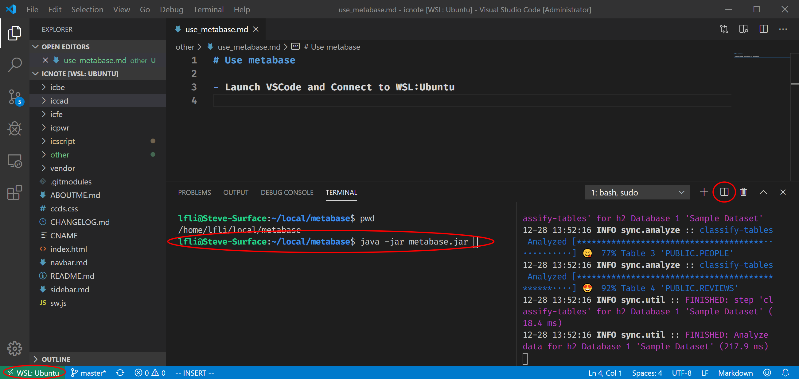
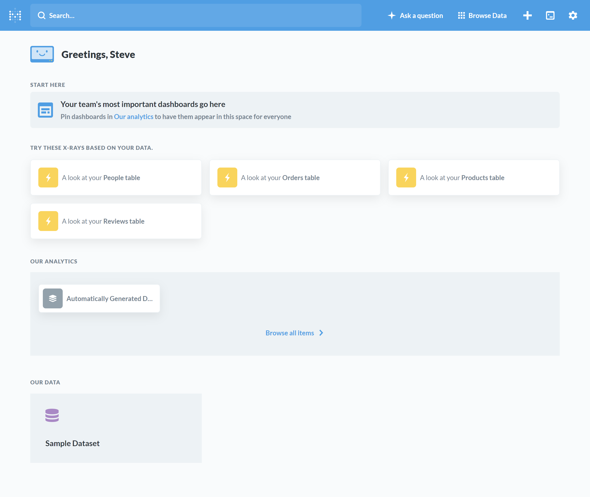

# Use metabase

Metabase is an open source business intelligence tool. It lets you ask questions about your data, and displays answers in formats that make sense, whether that’s a bar graph or a detailed table.

Your questions can be saved for later, making it easy to come back to them, or you can group questions into great looking dashboards. Metabase also makes it easy to share questions and dashboards with the rest of your team.

<!--

[Steve]

TODO:

- Reference of metrics system.
- Teach the user make full use of the data.

-->

## Launch VSCode

Make sure VSCode has been connected to WSL:Ubuntu



## Run Metabase

`java -jar metabase.jar`

> [!NOTE]
> If you don't have `java` command, run following line to get it.
> ```sh
> sudo apt intall default-jre
> ```

## Access metabase function

Visit http://localhost:3000 to setup the metabase if it runs at the first time.


