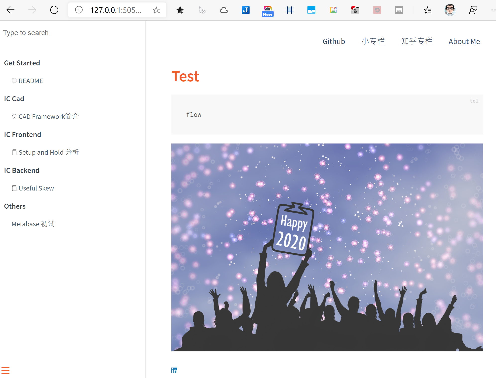

# 使用Toolatra 构建Web 服务器

> Toolatra is a modern Sinatra -like micro web framework for writing HTTP Tcl web applications.

Perl 的话，我推荐[mojolicious](https://www.mojolicious.org/)，这个也是一个搭建Web Framework 的好工具。

我的重点是用Tcl 来搭建一个开发生态。我赞同需要用不同的开发工具，语言达到效率最大化，但是统一语言，框架也有它的用武之地。

## 部署Toolatra

从Github 下载Toolatra，下载下来是一个tcl package。可以直接使用，无特殊的库依赖，只需要Tcllib 的支持。

为了最大程度的能够复现我的脚本，请参考我的[开发环境搭建](other/dev_env.md)。

```tcl
# git clone https://github.com/timkoi/toolatra.git ~/local/tcltk/toolatra
lappend auto_path "~/local/tcltk/toolatra"
exec mkdir -p ~/dev/tcltk/web
exec mkdir -p ~/dev/tcltk/web/public
exec mkdir -p ~/dev/tcltk/web/public/vendor
exec mkdir -p ~/dev/tcltk/web/public/assert
exec mkdir -p ~/dev/tcltk/web/templates
exec mkdir -p ~/dev/tcltk/web/tcl
# Checkout my samples
# source ~/dev/tcltk/web/tcl/app.tcl
```

## 运行docsify

```sh
tclsh tcl/app.tcl
```



## 话题扩展

在app.tcl 中，我们可以定义不同的路由（URL 路径）来实现不同的功能。

更多Web 应用正在调试中，将之前的web code snippet 放到toolatra 框架中，并开发应用级别的接口让普通用户也能方便地在Tcl 环境下做数据的收集整理，可视化。

详情请关注 [小专栏](https://xiaozhuanlan.com/icsteve)。
